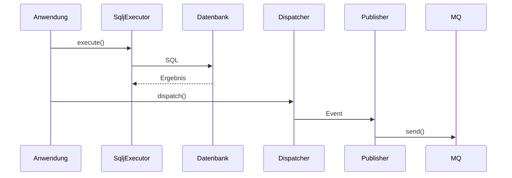

# Gesamtarchitektur von syncdb2

Die Bibliothek besteht aus mehreren Modulen, die gemeinsam eine transaktionale Ausführung von SQLJ mit MQ-Unterstützung ermöglichen.

## Module

1. `syncdb2-core` – Kernfunktionen und Transaktionssteuerung
2. `syncdb2-starter` – Auto-Konfiguration für Spring Boot
3. `syncdb2-mq-publisher` – MQ-Versand nach Commit
4. `syncdb2-mq-consumer` – MQ-Empfang
5. `syncdb2-example` – Beispielanwendung

## Sequence Diagram

## Checkliste Entwicklung

- [ ] Code-Stil prüfen
- [ ] Tests schreiben
- [ ] Dokumentation aktualisieren
- [ ] Sequenzdiagramme ergänzen
