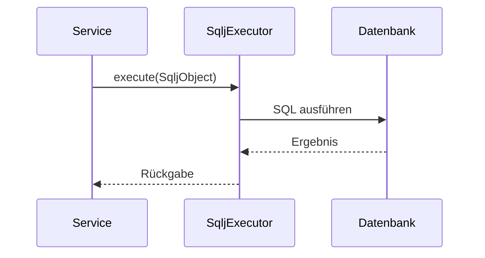

# Architektur `syncdb2-core`

Dieses Modul stellt die Grundfunktionen zur Ausführung von SQLJ innerhalb einer Spring-Transaktion bereit.

## Komponenten

- `SqljObject` – Funktionsschnittstelle für SQLJ-Ausführungen.
- `SqljExecutor` – Abstraktion zur Ausführung.
- `SqljExecutorImpl` – Implementierung mit `@Transactional`.
- `ConnectionUtils` – Hilfsklasse für transaktionsbewusste Verbindungen.

## Ablauf

