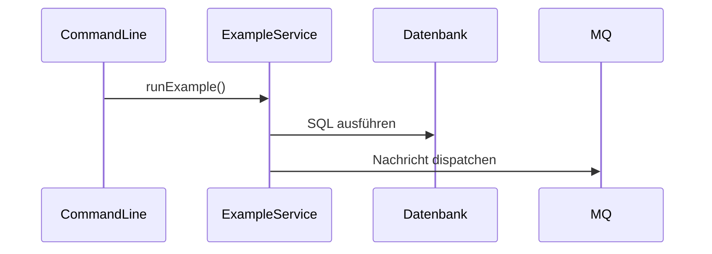

# Architektur `syncdb2-example`

Die Beispielanwendung zeigt die Nutzung der Bibliothek mit einer H2-Datenbank und MQ-Versand.

## Ablauf

```mermaid
sequenceDiagram
    participant C as CommandLine
    participant S as ExampleService
    participant DB as Datenbank
    participant MQ as MQ
    C->>S: runExample()
    S->>DB: SQL ausführen
    S->>MQ: Nachricht dispatchen
```
