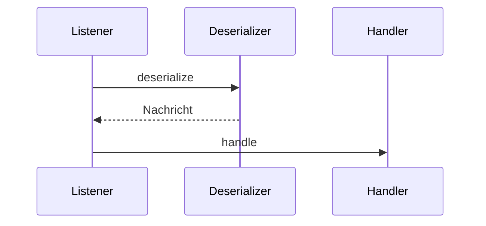

# Architektur `syncdb2-mq-consumer`

Dieses Modul stellt Listener-Komponenten für den Empfang von MQ-Nachrichten bereit.

## Komponenten

- `SqljMessageDeserializer` – wandelt Rohdaten um.
- `SqljMessageHandler` – verarbeitet Nachrichten.
- `SqljMessageListener` – verbindet beides.

## Sequenz

