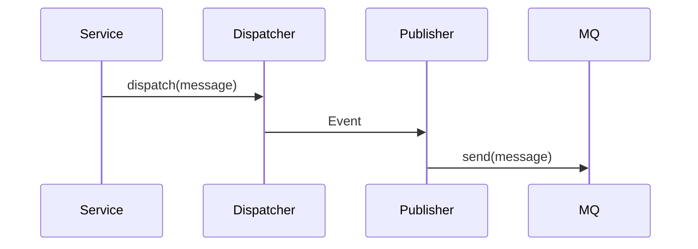

# Architektur `syncdb2-mq-publisher`

Dieses Modul ermöglicht das Senden von MQ-Nachrichten nach Abschluss einer Datenbanktransaktion.

## Komponenten

- `SqljMessage` – einfacher Datenträger.
- `SqljMessageDispatcher` – veröffentlicht Nachrichten als Event.
- `SqljMqPublisher` – hört Events und sendet sie nach Commit.

## Sequenz

