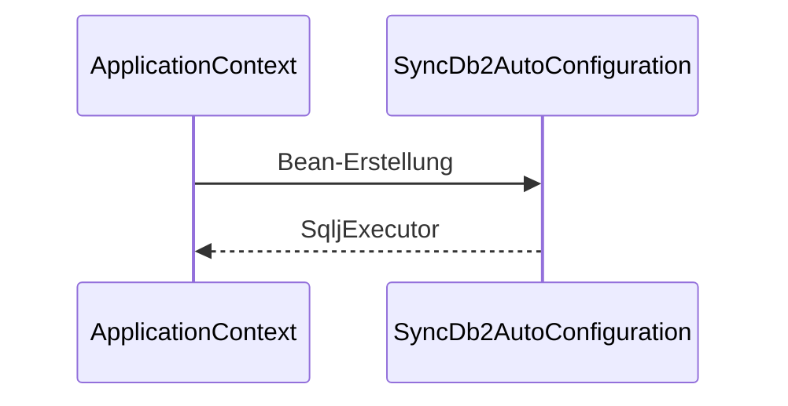

# Architektur `syncdb2-starter`

Das Starter-Modul liefert eine Auto-Konfiguration für den `SqljExecutor` und bindet ihn in Spring Boot ein.

## Auto-Konfiguration

- `SyncDb2AutoConfiguration` erstellt bei vorhandener `DataSource` einen `SqljExecutor`.
- Registrierung via `spring.factories`.

## Ablauf

